# Smartie Pants Backend API
API production link: https://smartie-pants-trivia.herokuapp.com/
agile board link: https://github.com/mstang15/trivia_be/projects/1
App production link: https://mstang15.github.io/trivia_fe/

This backend API is written with Ruby on Rails. Frontend is written in javascript.
You can find the frontend here: https://github.com/mstang15/trivia_fe

<h1>Endpoint Overview</h1>

The following endpoints are available for the frontend to use: 

## GET /api/v1/users 
Returns all users (no request body)

Response: 

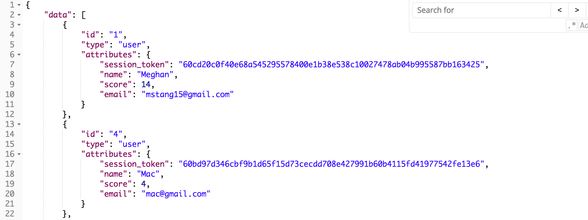)

## POST /api/v1/users
Register a new user

Request Body:

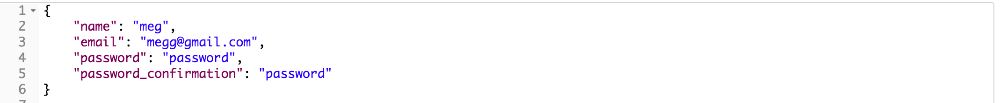)

Response:

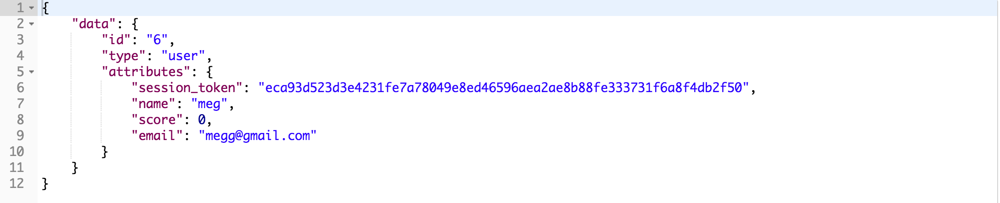)
 
## POST /api/v1/sessions
Log In a new user

Request Body:

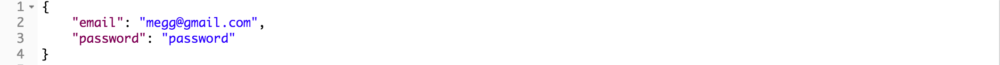)

Response:

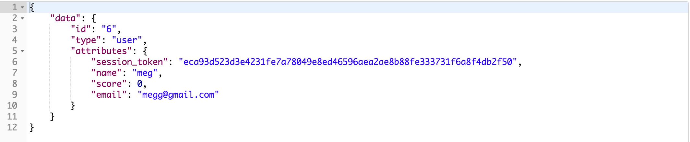)

## GET /api/v1/score
Get a score of a user

Request Body:

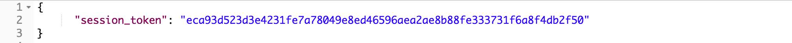)

Response is 
{
  score: 10
}

## PATCH /api/v1/score
Update a users total score

Request Body:

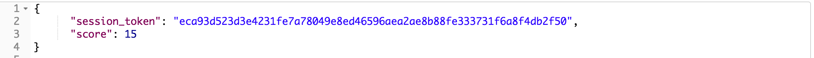)

Response is a 204 status

## POST /api/v1/games
Post a new game for a user

Request Body:

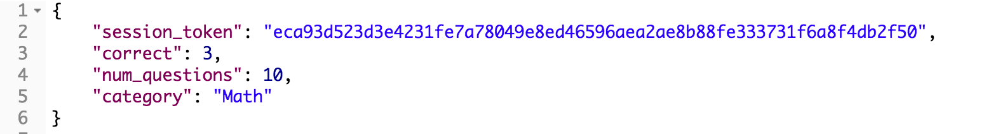)

Response:

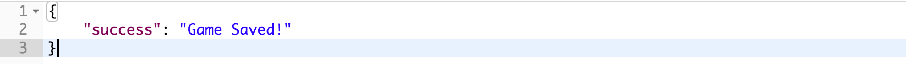)

## GET /api/v1/games
Get all games for a certain user

Request Body:

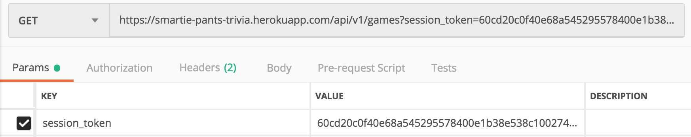)

Response:

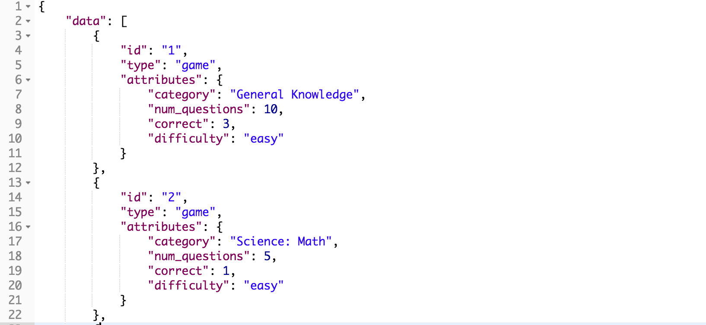)

## Set Up

1. git clone <paste repo link for trivia_be>
2. cd trivia_be
3. bundle install
4. rails s

After running rails s, api will be running on http://localhost:3000/
Run rspec to see testing coverage

## Built With

* Ruby
* Rails
* Rspec

##Creator
Meghan Stang (github: @mstang15)
